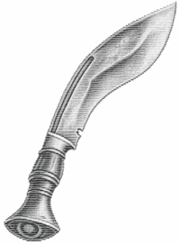

# kukri



## Building

```
make all
```

Runs the full pipeline: compiles the BPF object (`clang`), generates the C
and Rust skeletons (`bpftool gen skeleton` / `libbpf_cargo`), builds the
Rust binary in release mode, and copies the result to `build/kukri`.

Requires `clang` and `bpftool` on `PATH`. `make clean` removes `build/` and
runs `cargo clean`.

## Task List for Kukri Dev


[Google Sheet](https://docs.google.com/spreadsheets/d/e/2PACX-1vRe9IGTGjjrvLBAb20-S_kR6-Bu-5yjoS62JbkyRxaxArCrkbpESklHBgN3lkNOOXbJdaxtkgW0KoFw/pubhtml?gid=1246660885&single=true)
