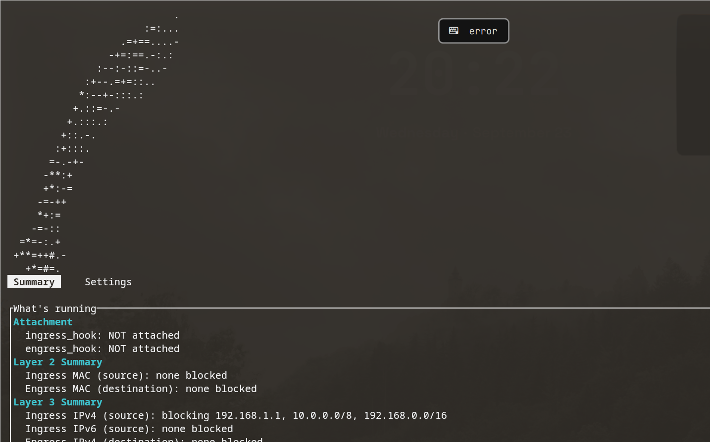
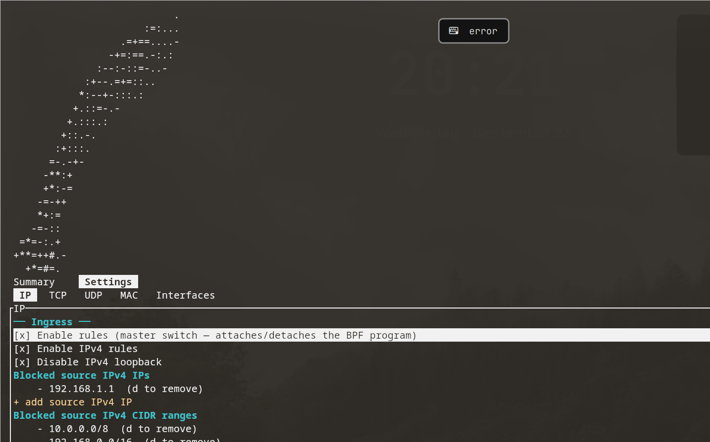
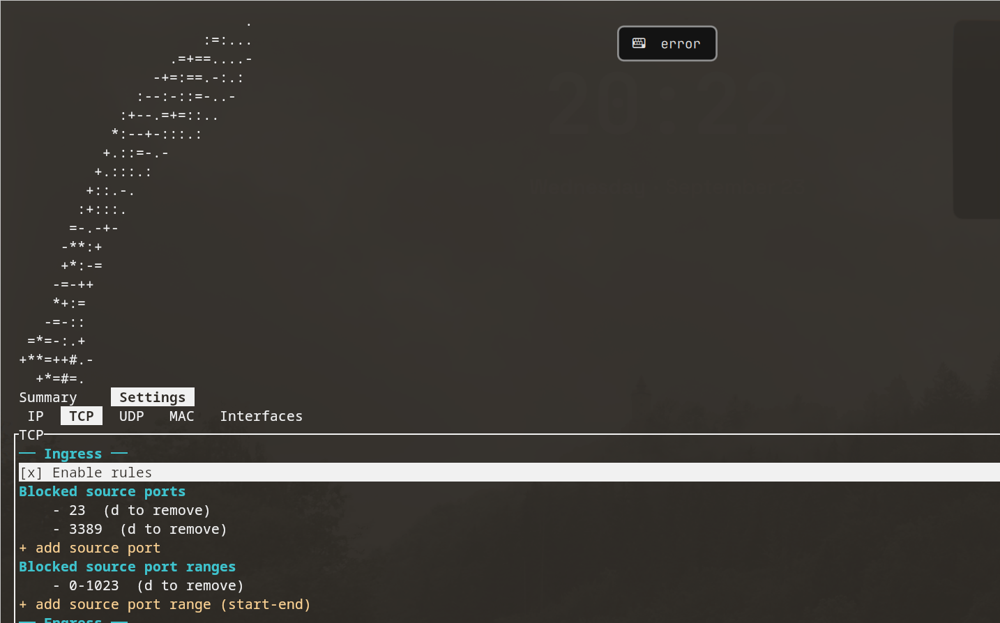
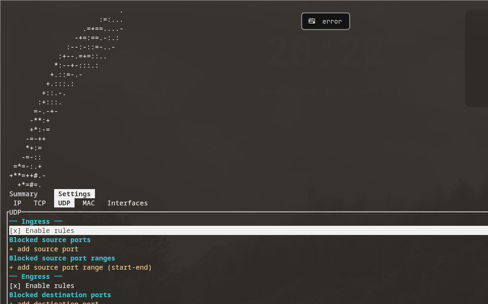
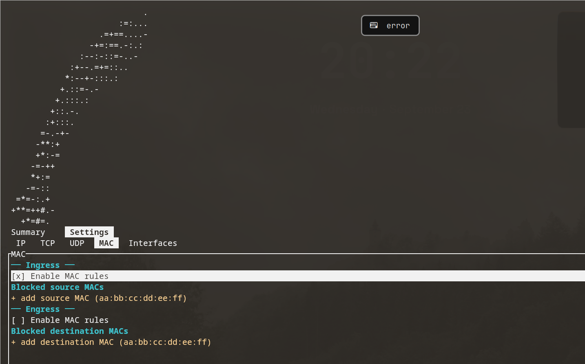
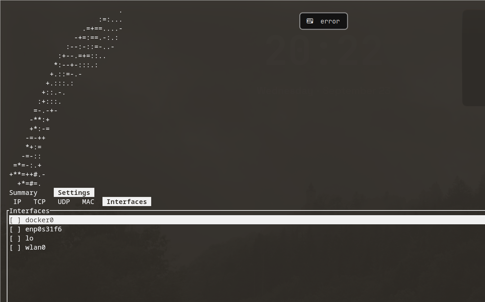

# Kukri
`⚠️ Note: Kukri is not a production grade ACL right now. Metrics show that it is almost 5X slow than iptables and nftables`

```
Date (UTC): 2026-09-23T13:01:03+00:00
Kernel: 7.2.6-arch2-1
iptables backend: legacy (not iptables-nft)
kukri XDP mode: native/driver (kernel mode 1)
iperf3: single TCP stream, 5s per tool, receiver rate

tool       | TCP throughput (Gbits/sec)
-----------|----------------------------
kukri      | 14.809
iptables   | 77.441
nftables   | 76.471
```
[](https://github.com/madhavkhoslaa/kukri/actions/workflows/ci.yml)

# Development tracker
Task list / tracker is here:
[Google Sheet](https://docs.google.com/spreadsheets/d/e/2PACX-1vRe9IGTGjjrvLBAb20-S_kR6-Bu-5yjoS62JbkyRxaxArCrkbpESklHBgN3lkNOOXbJdaxtkgW0KoFw/pubhtml?gid=1246660885&single=true)


An eBPF backed firewall with a terminal UI.

The idea is simple. You choose the interface, turn on the rules, and Kukri puts
small BPF programs in the packet path. Ingress runs with XDP. Egress runs with
TC. The UI is there so you do not have to remember every `bpftool`, `ip`, and
map update command while testing rules.

## What is it?

Imagine packets are walking into your machine.

Kukri stands at the door and asks questions like:

- is this source IP blocked?
- is this source port blocked?
- is this MAC address blocked?
- is this flow going too fast?

If the answer is yes, the packet is dropped early. If not, it keeps moving.

So in a way, Kukri is not trying to be a giant firewall framework. It is a small
Rust + eBPF project that makes packet filtering easy to see, easy to toggle, and
easy to test.

## What can it do right now?

- attach an ingress firewall with XDP
- attach an egress firewall with TC
- select interfaces from the TUI
- block IPv4 and IPv6 addresses / CIDR ranges
- block TCP and UDP ports / port ranges
- block MAC addresses
- enable simple rate limit stages
- show basic runtime status in the Summary tab

## Tour of every screen

The UI is split into two tabs — **Summary** and **Settings**. The Settings tab is
split into five sections: **IP**, **TCP**, **UDP**, **MAC**, and **Interfaces**.
That is the whole app: one read-only "what is actually running" page, plus five
editable rule pages.

Navigation is simple: Tab switches between the two tabs, Left/Right moves between
the five Settings sections, Up/Down moves the selection, Space toggles a switch
or an interface, d deletes a rule, Enter confirms a toggle or opens the add-value
prompt, s saves the config file, and q quits.

### Summary — live status and logs



<details>
<summary>What the Summary page tracks</summary>
The Summary tab is the read-only "is anything actually happening" page. It
opens with an Attachment block showing which programs are attached, to which
interfaces, and in which XDP mode they ended up in. Below that come the Layer
2, Layer 3, and Layer 4 rule summaries — one glance at what is blocked for
MACs, IPs, and ports, in each direction. The page finishes with the Event
stream, described under Logs below.
</details>

### IP — Layer 3



<details>
<summary>What the IP section can do</summary>
The IP section carries IPv4 and IPv6 side by side, for both directions. Kukri
blocks individual addresses and CIDR ranges; on ingress that means blocked
source addresses, on engress blocked destination addresses. A per-direction
"Disable loopback" switch drops the loopback address family so local traffic
never counts against the rule lists. Each direction also gets a master "Enable
rules" switch, and that master switch is what actually attaches or detaches
the eBPF program on the chosen interfaces — the finer switches (IPv4, IPv6,
MAC, ports, rate limits) just decide which rule stages sit inside the running
program. The section also hosts the rate limit settings, described under Rate
limiting below.
</details>

### TCP — Layer 4



<details>
<summary>What the TCP section can do</summary>
Each direction has its own "Enable rules" switch, its own blocked-port list,
and its own blocked-port range list. On ingress Kukri blocks by source port;
on engress it blocks by destination port. Ranges are entered as start-end, so
blocking 0-1023 knocks out all the privileged ports in one line. A TCP rule
only ever matches TCP packets, but it matches them regardless of whether the
packet travelled over IPv4 or IPv6.
</details>

### UDP — Layer 4



<details>
<summary>What the UDP section can do</summary>
The UDP section mirrors TCP exactly, one for each direction: an "Enable rules"
switch, a blocked-port list, and a blocked-port range list. On ingress Kukri
blocks by source port, on engress by destination port. Ranges are entered as
start-end. UDP rules never touch TCP traffic and vice versa, and one UDP port
map serves packets carried over IPv4 and IPv6 alike.
</details>

### MAC — Layer 2



<details>
<summary>What the MAC section can do</summary>
The MAC section blocks by Ethernet hardware address, entered as
aa:bb:cc:dd:ee:ff. Ingress blocks source MACs, engress blocks destination
MACs, each with its own enable switch and its own list. MAC rules are
evaluated before anything else: if the hardware address is blocked, the frame
never gets to the IP or port logic.
</details>

### Interfaces — where the hooks attach



<details>
<summary>How interface selection works</summary>
The Interfaces section lists every network interface Kukri can see, with a
checkbox marking the selected ones. The selection is capped at two interfaces
at a time. Choosing an interface is a hot change: the hooks detach and
re-attach to the new set immediately, so you never restart the app just to
point the firewall at a different NIC. The Attachment block on the Summary tab
always shows which interfaces the programs are actually live on, and the XDP
mode they ended up in.
</details>

### Rate limiting

<details>
<summary>How the rate limit stages work</summary>
Rate limits live inside the IP section. There are two independent limiters per
direction:

- a per-source-IP limiter on ingress (per-destination-IP on engress), and
- a per-destination-port limiter

Both are expressed in packets per second, and 0 means unlimited. Each limiter
has its own enable switch, so you can rate limit by IP without touching port
limits, or the other way round. When a flow trips the limiter, the offending
packets are dropped and logged as isolated rate-limit events rather than
ordinary ACL blocks.
</details>

### Logs and the event stream

<details>
<summary>What gets logged and where it shows up</summary>
The Event stream section on the Summary tab shows a running packets processed
counter and a packets rejected counter (the all-time rejected total, counted in
BPF at every drop — not the rolling ring-buffer tally), then per-reason drop
counters — MAC, IPv4 ACL, IPv6 ACL, TCP port, UDP port, IP rate limit, and port
rate limit — followed by the specific blocked IPs and rate-limited IPs/ports
that accumulated while Kukri was running. Drop events travel from kernel space
to the UI through an eBPF ring buffer, so the numbers on screen are the same
packets the kernel actually rejected, not a UI-side estimate.

Next to the logo, the **Blocked packets** box lists the most recent rejected
packets, newest first, one row per drop event. Each row shows the packet's
headers — ETH (the source/destination MAC), IP4/6 (the blocked address, or a
plain `IPv6` marker since IPv6 events carry no address), PORT, and the protocol
(`TCP`/`UDP`) — so you get a live peek at exactly what the firewall has been
turning away.
</details>

## Building

This is the command you want:

```bash
make all
```

This compiles the BPF object, generates the skeletons, and builds the Rust
release binary.

The binary you should run is:

```bash
sudo ./target/release/kukri examples/kukri.config.json
```

Important thing because it bit me too: `make all` builds `target/release/kukri`.
Do not run an old `./build/kukri` and then wonder why the new changes are not
showing up.

You need these on your machine:

- Rust / Cargo
- clang
- bpftool
- libbpf dependencies
- root privileges or the required BPF/network capabilities

## Running it

```bash
sudo ./target/release/kukri examples/kukri.config.json
```

In the TUI:

1. Go to `Settings -> Interfaces`.
2. Select the interface, for example `wlan0`.
3. Go to `Settings -> IP`.
4. Turn on `Ingress -> Enable rules`.

Why the IP tab? Because that `Enable rules` is the master switch. The TCP, UDP,
MAC, IPv4, IPv6 toggles are feature/stage switches. They decide what logic runs
after the main program is attached.

## Checking if XDP is actually attached

Use this while Kukri is still running:

```bash
sudo bpftool net show dev wlan0
ip -d link show dev wlan0
```

On WiFi cards, native XDP may fail depending on the driver. Kukri tries native
first and then falls back to generic/SKB XDP. If the attach worked, you should
see XDP information from the commands above.

## Config file

The config lives in JSON. The example file is:

```bash
examples/kukri.config.json
```

You can edit it by hand, or use the TUI and press `s` to save.

Small note: selecting an interface and saving only saves the interface. The BPF
program attaches when the master rule switch is on.
